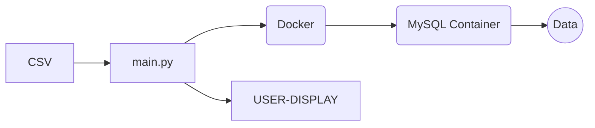

# Post-Project
A project to keep us on our feet and to further develop skills/techniques in Data Engineering. We will just be given a CSV containing our raw data and we will have to; create our own Trello board, develop an Agile way of working, host our own team Retro sessions and present a full GitHub Repo and test (PowerPoint, programme presentation and GitHub structure). 

## About the Project
Data that we will be using is data from Nasa's 'Lightning Imaging Sensor (LIS) on TRMM Science Data V4' (tropical rainstorms measurement mission). The columns are already stated in the CSV. 
>More information about the data set can be found here

    https://search.earthdata.nasa.gov/search/granules?p=C1983762329-GHRC_DAAC&pg[0][v]=f&pg[0][gsk]=-start_date&tl=1674974563.47!3!!&fst0=Atmosphere&fsm0=Atmospheric%20Electricity 

## Scenario
The Tropical Rainfall Measuring Mission (TRMM) was a joint space mission between NASA and JAXA designed to monitor and study tropical rainfall. The term refers to both the mission itself and the satellite that the mission used to collect data. TRMM was part of NASA's Mission to Planet Earth, a long-term, coordinated research effort to study the Earth as a global system. The satellite was launched on 27 November 1997 from the Tanegashima Space Center in Tanegashima, Japan. TRMM operated for 17 years, including several mission extensions, before being decommissioned on 15 April 2015. TRMM re-entered Earth's atmosphere on 16 June 2015.

Nasa would like to organise and visualise this data in a simple, easy to use programme. Nasa only wants data starting from 1998 to 2011 and would like to have options to sort from either provider, platform, time/time ended, processing level. also options to go further and also add a year to their search if they deem necessary.

>**Strech Goal** 
>If possible a graph to be created also to display most recorded data from a short name. Also, if possible to create this in Azure (since we no longer have access to AWS) but not necessary. 

## Programme Flow

